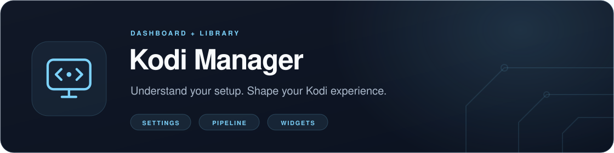
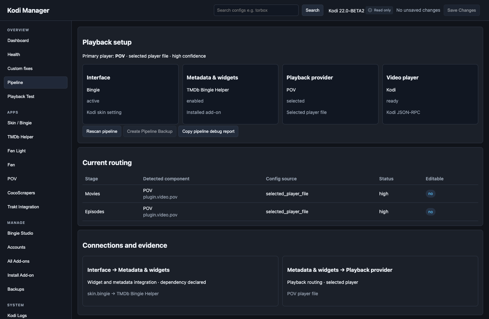

<p align="center">
  
</p>

<p align="center">
  <a href="https://github.com/glasgowm148/kodi-manager/actions/workflows/ci.yml"></a>
  <a href="https://github.com/glasgowm148/kodi-manager/releases"></a>
  <a href="pyproject.toml"></a>
  <a href="LICENSE"></a>
</p>

<p align="center">
  <a href="#what-you-can-do">Features</a> ·
  <a href="#quick-start">Quick start</a> ·
  <a href="docs/widget-cache.md">Faster rows</a> ·
  <a href="#python-library">Python library</a> ·
  <a href="#documentation">Documentation</a>
</p>

**See what your Kodi setup is doing, fix it from a browser, and make slow home-screen rows fast.**
Kodi Manager is a small service add-on with a local web dashboard. It shows which add-ons are
installed and how playback is wired, lets you edit add-on settings and back them up, and can serve
any skin's widget rows from a cache so they appear in about half a second. Use it on its own or as
the on-device companion to [nvidia-MCP](https://github.com/glasgowm148/nvidia-MCP).


*Dashboard captured with synthetic demo data. No personal accounts, watch history or TV screenshots are included.*

> [!NOTE]
> **Prerelease.** 0.6.0 is in use on an NVIDIA Shield with Kodi 22 beta 2 and the Bingie skin.
> Other skins and devices are covered by automated tests, not yet by live use; see
> [compatibility](docs/compatibility.md). Write mode is off until you turn it on, and every change
> is backed up first.

## What you can do

| Feature | What it does | Needs |
| --- | --- | --- |
| **[Faster rows](docs/widget-cache.md)** | Serves home-screen rows from a cache, adds **View more** to the end of each list, refreshes in the background | Any skin, any video add-on, Kodi 20+ |
| **Setup dashboard** | Shows installed and enabled add-ons and saved configuration, and marks anything it can't confirm as unknown | Any Kodi |
| **Friendly settings** | Searchable add-on settings with current and default values; account tokens are visible so you can enter and repair them | Any Kodi |
| **Playback pipeline** | Shows the selected player, helper routing and evidence for provider and account links | Any Kodi |
| **Backups** | Add-on and full-stack checkpoints, restore with undo, diagnostic logs | Any Kodi |
| **Layout editor** | Previews and applies hub and row changes after you review them | Bingie 2.0.2 with Skin Shortcuts 2.0.3 |
| **Python library** | Authenticated API client and offline settings parser for scripts and MCP clients | Python 3.9+ |

<details>
<summary><strong>See the playback pipeline</strong></summary>



*Synthetic example showing a Bingie → TMDb Bingie Helper → POV setup. Detected relationships are separate from account authentication.*

</details>

## Which part runs where?

| Part | Runs on | Purpose |
| --- | --- | --- |
| **Kodi add-on** (`service.kodi.addonadmin`) | Inside Kodi | Reads the live profile, serves the dashboard and API, and runs the widget cache |
| **Browser dashboard** | Any device on your home network | Uses that API to inspect and configure Kodi |
| **Python library** (`kodi-manager`) | Your computer | Lets scripts and MCP clients use the API, or parse settings offline |

The Kodi add-on and the Python library are separate downloads built from the same source.
Installing one does not install the other.

## Quick start

1. **Download** `service.kodi.addonadmin-<version>.zip` and `SHA256SUMS` from
   [Releases](https://github.com/glasgowm148/kodi-manager/releases), and check the checksum.
2. **Install it in Kodi.** Copy the ZIP to the device, then use **Add-ons → Install from zip file**.
   Allow unknown sources if Kodi asks.
3. **Turn on network access.** Go to **Add-ons → My add-ons → Services → Kodi Manager → Configure**,
   enable LAN access and set host `0.0.0.0`, port `8765`. Restart Kodi.
4. **Open the dashboard.** Go to `http://<kodi-ip>:8765` and enter the access token. Kodi Manager
   generates it on first start and stores it as `auth_token` in the active profile's
   `addon_data/service.kodi.addonadmin/settings.xml`; the setup guide shows how to read it.

The [setup guide](docs/setup.md) has exact menus for each step, where to find the token, and
connection troubleshooting. No particular skin is needed.

<details>
<summary><strong>Let an AI agent do the computer side</strong></summary>

You handle the TV settings and Kodi's installer; the agent downloads, verifies and transfers the
ZIP and connects to the dashboard. On a Shield, complete nvidia-MCP's
[network-debugging preparation](https://github.com/glasgowm148/nvidia-MCP/blob/main/docs/setup.md) first.

```text
Set up https://github.com/glasgowm148/kodi-manager for my Kodi device.
Read docs/setup.md and handle the computer steps automatically.
Kodi IP: YOUR_KODI_IP
Check for an existing installation and preserve customizations.
Download and verify the companion ZIP, transfer it using authorized access,
and tell me where to select it in Kodi's native installer.
Retrieve the Manager token privately and verify read-only dashboard/API access.
Keep write mode off. Do not interrupt playback.
```

</details>

## Faster rows

1. Open any video add-on folder you'd like as a row, open its context menu and choose
   **Add to Kodi Manager cached rows**.
2. In your skin's row or widget picker, browse to **Kodi Manager** and pick it.

On Skin Shortcuts skins, **Route new skin widget rows through the widget cache** switches existing
rows over automatically, after backing them up. See the [widget cache guide](docs/widget-cache.md)
for:

- per-row options: more pages, hide watched;
- the refresh schedule and row item limits;
- what is kept from each add-on;
- how to undo.

## Safety

- **Write mode starts off.** Turn it on in the add-on settings when you want to change
  configuration. Python clients also need `allow_writes=True`.
- **Backups first.** Settings and layout changes take a backup first, and restores keep an undo
  checkpoint. Automatic row routing copies the skin's files before rewriting them.
- **Playback is protected.** Menu rebuilds and installs refuse to run while something is playing.
- **Layout writes are pinned.** They only run on the reviewed Bingie 2.0.2 / Skin Shortcuts 2.0.3
  source hashes. Other skin versions are view-only.
- **Keep it on your home network.** The service uses bearer tokens over plain HTTP; never expose
  it to the internet. Backups and diagnostics can contain credentials.

Releases contain Manager code only: no household settings, accounts, watch history or third-party
add-on patches. See [API boundaries](docs/api.md).

## Python library

Use **Python 3.9+**. The library has no runtime dependencies; install the wheel from
[Releases](https://github.com/glasgowm148/kodi-manager/releases) or from source.

```python
import os
from kodi_manager import ManagerClient

manager = ManagerClient("http://192.168.1.50:8765", os.environ["KODI_MANAGER_TOKEN"])
print(manager.status())
print(manager.pipeline())
print(manager.layout())
```

Use your device's address. `ManagerClient` also covers health, add-ons, settings, sources, bounded
folder browsing and layout preview/apply. Catch `ManagerError`; the client caps response sizes and
rejects redirects. See the [API guide](docs/api.md) for the preview/apply workflow.

<details>
<summary><strong>Install from source and parse settings offline</strong></summary>

```sh
git clone https://github.com/glasgowm148/kodi-manager.git
cd kodi-manager
python3 -m venv .venv
.venv/bin/python -m pip install .
```

On Windows use `py -3 -m venv .venv` and `.venv\Scripts\python.exe`.

```python
from kodi_manager import parse_schema, flatten_settings

schema = parse_schema("addon/resources/settings.xml", "addon", "userdata/settings.xml")
settings = flatten_settings(schema)  # Secret values are masked.
```

The client and parser exports above are the public interface. Modules such as `server`,
`pipeline`, `skin_layout` and `widget_cache` expect Kodi's `xbmc` runtime and may change while the
project is in prerelease.

</details>

## Documentation

| Guide | Use it for |
| --- | --- |
| [Setup](docs/setup.md) | Installing on the TV, finding the token, connection troubleshooting |
| [Widget cache](docs/widget-cache.md) | Faster rows on any skin, row options, refresh schedule, undo |
| [API](docs/api.md) | Endpoints, authentication, layout workflows and runtime boundaries |
| [Compatibility](docs/compatibility.md) | What has been tested live and what only in CI |
| [Recovery](docs/recovery.md) | Backup, restore and upgrade preparation |
| [Contributing](CONTRIBUTING.md) · [Changelog](CHANGELOG.md) | Development, packaging and release checks |
| [Security](SECURITY.md) | Private diagnostics and vulnerability reports |

The library and the Kodi ZIP share `src/kodi_manager`; the dashboard lives in `web/`. CI runs the
Python and UI tests on Linux and Windows, installs a fresh wheel, and checks release contents.

---

[MIT license](LICENSE). Independent project; not affiliated with the Kodi Foundation, NVIDIA or any add-on author. You supply your own add-ons and accounts.
