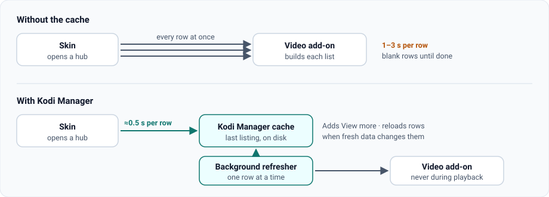

<p align="center">
  
</p>

<p align="center">
  <a href="https://github.com/glasgowm148/kodi-manager/actions/workflows/ci.yml"></a>
  <a href="https://github.com/glasgowm148/kodi-manager/releases"></a>
  <a href="pyproject.toml"></a>
  <a href="LICENSE"></a>
</p>

<p align="center">
  <a href="#faster-rows">Faster rows</a> ·
  <a href="#quick-start">Quick start</a> ·
  <a href="#the-dashboard">Dashboard</a> ·
  <a href="#questions">Questions</a> ·
  <a href="#for-developers">Developers</a>
</p>

**Make Kodi's home screen fast, and see and fix your setup from a browser.**

Kodi Manager is a small Kodi add-on. It does three things:

- **Faster rows.** Home-screen rows load from a cache in about half a second instead of waiting
  1–3 seconds each for the add-on behind them. Every list gets a **View more** item at the end.
- **A dashboard.** It shows what's installed, how playback is wired and what each add-on is set to.
  You can change settings from a phone or computer.
- **Backups.** Checkpoints of add-on settings, with one-step restore and undo.

It works with any skin and any video add-on. Nothing is uploaded anywhere: the add-on and its
dashboard stay on your home network.

> [!NOTE]
> **Prerelease.** 0.6.2 is in use on an NVIDIA Shield with Kodi 22 beta 2 and the Bingie
> skin. Other skins and devices are covered by automated tests rather than live use so far; see
> [compatibility](docs/compatibility.md).

## Faster rows

<p align="center">
  
</p>

Measured on an NVIDIA Shield (Kodi 22 beta 2, Bingie skin), from opening a page until its rows
appeared:

| Page | Without the cache | With the cache |
| --- | --- | --- |
| Movies | about 3 s | about 1 s |
| TV shows | about 4 s | about 0.5 s |
| Favourites | about 6 s | about 0.5 s |

**Add a row in any skin:**

1. Open the add-on folder you want as a row (a film list, a Trakt list, a genre).
2. Open its context menu and choose **Add to Kodi Manager cached rows**.
3. In your skin's row or widget picker, choose **Kodi Manager → Cached rows →** your row.

**Or switch existing rows over automatically.** On skins built with Skin Shortcuts (most popular
skins), turn on **Route new skin widget rows through the widget cache**. Kodi Manager backs up the
skin's files, then switches supported rows over the next time Kodi starts.

The [widget cache guide](docs/widget-cache.md) covers more pages per row, hiding watched items
in a single row, the refresh schedule, and how to undo.

## Quick start

1. **Download** `service.kodi.addonadmin-<version>.zip` from
   [Releases](https://github.com/glasgowm148/kodi-manager/releases).
2. **Install it.** In Kodi, choose **Add-ons → Install from zip file** and pick the ZIP. Allow
   unknown sources if Kodi asks.
3. **Allow the dashboard on your network.** Go to **Add-ons → My add-ons → Services → Kodi Manager →
   Configure**. Turn on **LAN access**, set host `0.0.0.0` and port `8765`, then restart Kodi.
4. **Open the dashboard.** In Kodi, open **Add-ons → Video add-ons → Kodi Manager → Open the
   dashboard on another device**. It shows the address and access token to use in a browser.

Cached rows don't need step 3; only the dashboard does. The
[setup guide](docs/setup.md) has menu-by-menu steps and troubleshooting.

<details>
<summary><strong>Let an AI agent do the computer side</strong></summary>

You handle the TV and Kodi's installer; the agent downloads, verifies and transfers the ZIP and
connects to the dashboard. On a Shield, complete nvidia-MCP's
[network-debugging preparation](https://github.com/glasgowm148/nvidia-MCP/blob/main/docs/setup.md) first.

```text
Set up https://github.com/glasgowm148/kodi-manager for my Kodi device.
Read docs/setup.md and handle the computer steps automatically.
Kodi IP: YOUR_KODI_IP
Check for an existing installation and preserve customizations.
Download and verify the companion ZIP, transfer it using authorized access,
and tell me where to select it in Kodi's native installer.
Retrieve the Manager token privately and verify read-only dashboard/API access.
Keep write mode off. Do not interrupt playback.
```

</details>

## The dashboard


*Captured with synthetic demo data.*

| Page | What it shows or changes |
| --- | --- |
| **Setup** | Installed and enabled add-ons and saved configuration; anything it can't confirm is marked unknown |
| **Settings** | Each add-on's settings with current and default values, searchable. Account tokens are visible so you can enter and repair them |
| **Playback pipeline** | Which player is selected, how metadata helpers route to it, and evidence for provider and account links |
| **Backups** | Add-on and whole-setup checkpoints, restore with undo, diagnostic logs |
| **Layout** | Previews and applies hub and row changes after you review them (Bingie 2.0.2 only) |

<details>
<summary><strong>See the playback pipeline</strong></summary>


*Synthetic example: Bingie → TMDb Bingie Helper → POV.*

</details>

## Questions

**Will it work with my skin?**
Cached rows work in any skin whose row picker can browse add-ons, which is nearly all of them.
Automatic switching needs a Skin Shortcuts skin. The layout page is Bingie-only.

**Which add-ons?**
Any video add-on. Fen, Fen Light, POV and TMDb Helper are recognised, so their rows get extras such
as more pages and View more. Other add-ons get View more whenever they offer another page.

**Will it slow Kodi down?**
Not noticeably. Refreshes run one row at a time in the background and pause while anything plays.
Rows refresh only when stale: progress rows (continue watching, watchlists) every 15 minutes,
other lists every 6 hours. Each refresh is one call to the add-on, the same call the skin would
have made.

**What do I lose?**
An add-on's own long-press menu on cached items, and rows can be a few minutes behind. Kodi Manager
adds watchlist and "already watched" entries where it can. The [guide](docs/widget-cache.md#limits)
lists the details.

**How do I undo it?**
Remove or replace a cached row in your skin like any other row. To undo the automatic switch,
restore the skin files from `script.skinshortcuts/kodi-manager-backups/`. Do that before
uninstalling Kodi Manager, because cached rows stay empty without it.

**Which Kodi versions?**
Kodi 19 or newer for the dashboard, and Kodi 20 or newer for the cache. It's tested on Kodi 22
beta 2; see [compatibility](docs/compatibility.md).

**Is it safe?**

- **Write mode starts off.** You turn it on in the add-on's settings when you want to change
  configuration.
- **Backups first.** Settings and layout changes take a backup first.
- **Playback is protected.** Installs and menu rebuilds refuse to run while something is playing.
- **Keep it on your home network.** The dashboard uses an access token over plain HTTP, so don't
  expose it to the internet. Releases contain Kodi Manager's code only: no accounts, watch history
  or third-party add-on patches.

## For developers

The same code ships as a Python library with no dependencies (Python 3.9+), for scripts and MCP
clients such as [nvidia-MCP](https://github.com/glasgowm148/nvidia-MCP).

```python
import os
from kodi_manager import ManagerClient

manager = ManagerClient("http://192.168.1.50:8765", os.environ["KODI_MANAGER_TOKEN"])
print(manager.status())
print(manager.pipeline())
```

`ManagerClient` also covers health, add-ons, settings, sources, folder browsing and layout
preview/apply; writes need `allow_writes=True`. The [API guide](docs/api.md) lists every endpoint.

<details>
<summary><strong>Install from source, parse settings offline</strong></summary>

```sh
git clone https://github.com/glasgowm148/kodi-manager.git
cd kodi-manager
python3 -m venv .venv
.venv/bin/python -m pip install .
```

On Windows use `py -3 -m venv .venv` and `.venv\Scripts\python.exe`.

```python
from kodi_manager import parse_schema, flatten_settings

schema = parse_schema("addon/resources/settings.xml", "addon", "userdata/settings.xml")
settings = flatten_settings(schema)  # Secret values are masked.
```

`ManagerClient`, `parse_schema` and `flatten_settings` are the public interface. Modules such as
`server` and `widget_cache` expect Kodi's runtime and may change before 1.0.

</details>

| Guide | Use it for |
| --- | --- |
| [Setup](docs/setup.md) | Installing, the access token, connection troubleshooting |
| [Widget cache](docs/widget-cache.md) | Row options, refresh schedule, limits, undo |
| [API](docs/api.md) | Endpoints, authentication, layout workflows |
| [Compatibility](docs/compatibility.md) | What has been tested live and what only in CI |
| [Recovery](docs/recovery.md) | Backup, restore and upgrades |
| [Contributing](CONTRIBUTING.md) · [Changelog](CHANGELOG.md) · [Security](SECURITY.md) | Development, release notes, private reports |

---

[MIT license](LICENSE). Independent project; not affiliated with the Kodi Foundation, NVIDIA or any add-on author. You supply your own add-ons and accounts.
